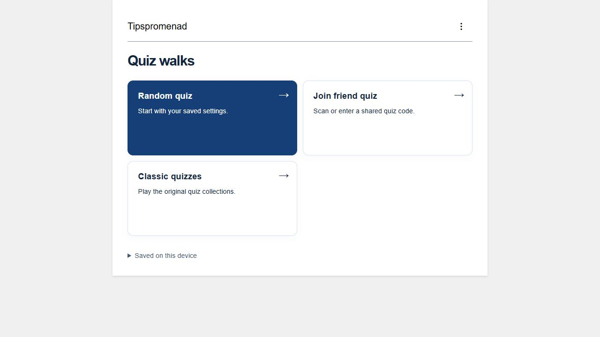
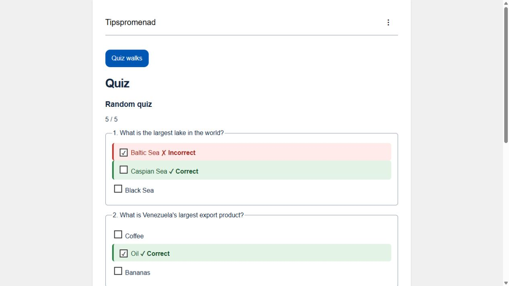

# Tipspromenad participant website

**[Open Tipspromenad in your browser](https://nilsson82.github.io/TipspromenadQuizWebPage/)**

[Android app](https://github.com/Nilsson82/Tipspromenad-app-for-Android) · [Shared question database](https://github.com/Nilsson82/Tipspromenad)

## Screenshots

Actual browser screenshots of this version. The website uses the same menu and quiz presentation as Android; creating and managing shared quizzes is available in the Android app.





## Latest behavior

- Clean menu without numbered tiles; options are in the top-right **⋮ Settings** menu.
- Random Quiz uses saved settings and starts without a participant name.
- Finish corrects the existing question sheet, highlights correct answers and marks wrong choices red. A score line replaces the finish button.
- Shared quizzes remember the previous participant name locally and show it above the questions.
- Six interface languages, portable quiz/result QR codes, and classic quizzes remain available.


Static participant website plus the shared runtime bundled in the Android app. No backend, accounts or dependency installation.

The website offers **Random Quiz**, **Join Friend Quiz**, and the existing **Classic Quizzes**. Android additionally exposes Create Quiz and organizer result collection. Participants scan or paste a portable `TIPQ1.` code, enter their name, answer questions and return a `TIPR1.` result QR/code. These are complete offline payloads, not very short lookup keys. Future Wi-Fi lookup is not implemented.

Settings is in the top-right three-dot menu. App language and question language are independent; en/sv/es/da/no/fi are supported. New question selections use 2/3/4 visible answers derived deterministically from four stored options. The canonical bank currently has 25 selectable questions in en/sv/es and six in da/no/fi. Insufficient pools and incompatible revisions fail explicitly.

## Run and test

Node 22 or newer; no packages required:

```sh
node tools/serve.cjs
node --test tests/*.test.cjs
```

Preview: `http://127.0.0.1:8085`. Serve via HTTP/HTTPS, not file://. There is no production compilation step. Deploy the repository root on existing GitHub Pages, keeping HTML, CSS, JS, locales, Data and service-worker.js together. Nothing has been pushed or deployed by this development run.

A service worker caches the shell and bundled questions after an online visit. Load online before an offline walk and check the target browser; browser cache/storage policies can vary. Classic external images still need internet. Update the service-worker cache version whenever bundled files change. A previous worker can remain active until old tabs close.

## Structure

- `lib/walk-core.js`: compact formats, database validation, seeded options and scoring.
- `lib/walk-ui.js`: participant flow and Android organizer UI.
- `lib/walk-store.js`: device-local IndexedDB records.
- `lib/walk-motion.js`: foreground distance filtering and timer math.
- `lib/quiz-core.js`, `lib/quiz-ui.js`, `lib/correction.js`: retained classic behavior.
- `lib/vendor/`: local QR generator/decoder and notices.
- `Data/revision-1.json`: immutable distribution from [the canonical question repository](https://github.com/Nilsson82/Tipspromenad).
- `Data/data_*.json`, `Data/multilingual.json`: retained classic data; no destructive migration.
- `locales/walk.json`, `locales/ui.json`: UI translations.

Edit question revisions in Tipspromenad, shared runtime here, then run the Android workspace's `tools/sync-offline-assets.ps1`. Android assets are distributable copies, not a second editing source. This website runs without sibling checkouts.

## Privacy and limits

Participant names/answers/results remain in browser storage unless the user shares the result code. No user data is uploaded to the question repository. Optional revision downloads request only public question files. Clearing site data deletes attempts and offline caches. Scores are locally recomputed, but public source answers and unsigned result payloads do not prevent cheating.

See [privacy information](PRIVACY_POLICY.md), [portable format and verification](docs/PORTABLE-WALKS.md), [Source publication notice](LICENSE) and [Android app](https://github.com/Nilsson82/Tipspromenad-app-for-Android). Vendored QR licenses remain in lib/vendor. Legacy facts and translations still need editorial review; physical camera/GPS and cross-browser offline testing remain release checks.

## Publish updates on GitHub Pages

1. Commit and push this repository to its `main` branch, including `service-worker.js`, `walk.css`, `lib/`, `locales/`, `Data/`, and `.nojekyll`.
2. In the GitHub repository, open **Settings → Pages**. Use **Deploy from a branch**, branch **main**, folder **/(root)**, and save.
3. Wait for **pages build and deployment** in Actions to finish successfully.
4. Open [the website](https://nilsson82.github.io/TipspromenadQuizWebPage/). No release tag, npm install, or compilation is required.

See [GitHub's publishing-source documentation](https://docs.github.com/en/pages/getting-started-with-github-pages/configuring-a-publishing-source-for-your-github-pages-site).

The versioned service worker downloads a complete new offline shell. Existing tabs finish using their current version: close all tabs for this site, then reopen it online to activate a waiting update. Do not clear site storage just to update, because that also removes saved participant names and quizzes. Keep bumping the cache name in `service-worker.js` for future runtime/data changes. Screenshots are repository documentation and are not part of the offline quiz cache.